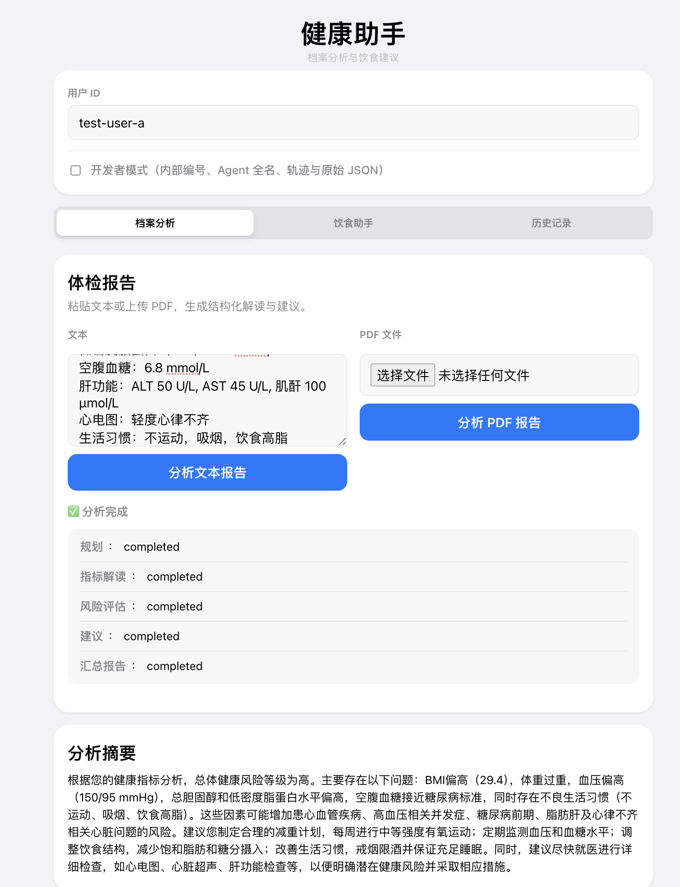
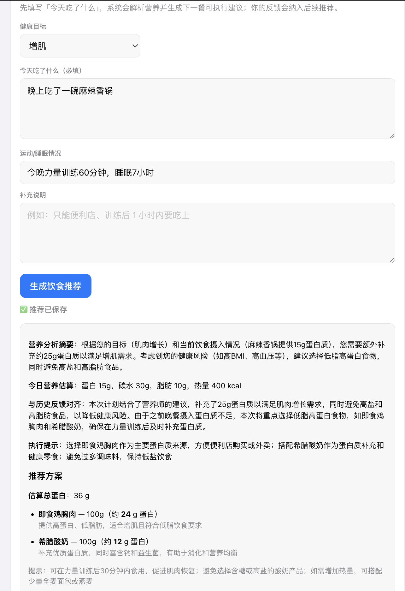
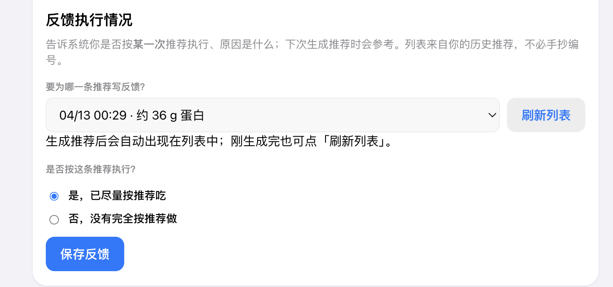

# HealthRecordAgent · 健康档案助手

基于 **HelloAgents**（`HelloAgentsLLM`）与 **FastAPI** 的多智能体应用：体检报告解读、饮食推荐与执行反馈闭环，可选 **Milvus 语义检索 + SQLite** 长期记忆。

> **声明**：本项目输出仅供健康信息与流程演示，**不能替代**执业医师的诊断或处方。

---

## 界面概览

截图位于 **`frontend/screenshots/`**，更新时替换同名文件即可。

**档案与报告**（`report.png`）



**饮食推荐**（`diet.png`）



**执行反馈 Reflect**（`reflect.png`）



---

## 功能概览

| 模块 | 说明 |
|------|------|
| **档案分析** | 文本或 PDF 体检报告 → 多 Agent 流水线（规划 → 指标 → 风险 → 建议 → 报告），异步任务可轮询状态 |
| **饮食助手** | 自然语言 **今日饮食日志** → LLM 解析与营养汇总 → 营养师 / 教练 / 习惯 多阶段结构化输出；结合历史记忆与 Reflect 反馈 |
| **长期记忆** | SQLite 存运行记录与反馈；可选 Milvus 向量索引 + Hybrid 检索（失败回退 SQL 列表） |
| **可观测** | `pipeline_trace`、`errors` / `degraded`、`rag_debug`；报告/饮食 run 的 observability 接口与饮食 **replay** |
| **前端** | 静态页 + Tab（档案分析 \| 饮食助手 \| 历史）；类 Apple Health 信息层级；**开发者模式**控制技术细节展示；饮食 **Reflect** 反馈闭环 |

---

## 架构要点

- **编排**：健康分析为 **Plan-and-Execute** 风格（`PlannerAgent` 后多 Specialist 串行）；饮食为 **多阶段流水线**（食物解析 → 营养师 → 教练 → 习惯），各阶段 **Pydantic** 校验与失败降级。
- **工具**：饮食场景内 **Tool Use**（如营养查询、活动/睡眠摘要 Mock，可替换真实数据源）。
- **LLM**：通过 `hello_agents.HelloAgentsLLM` 调用兼容 OpenAI 的 API；Agent 基类与业务流水线在本仓库 `backend/agents`、`backend/service` 中实现。
- **记忆与 RAG**：历史报告、饮食与反馈等落在 **SQLite**；需要语义召回时，对记忆做 **向量索引（Milvus）**，按用户与场景检索相关片段并注入 Agent。Milvus 未开或不可用时 **自动回退** 为基于 SQL 的近期记忆列表。

---

## 目录结构（节选）

```
HealthRecordAgent/
├── README.md
├── requirements.txt
├── data/                    # 默认 SQLite：health_memory.db（可 .gitignore）
├── backend/
│   ├── api/main.py          # FastAPI 入口
│   ├── agents/              # 报告分析各 Agent
│   ├── service/             # health_analysis、diet_pipeline 等
│   ├── memory/              # SQLite 存取
│   ├── rag/                 # 嵌入、Milvus、统一 retrieve
│   └── tools/               # 饮食相关工具
└── frontend/
    ├── index.html, app.js, style.css
    └── screenshots/         # README 界面截图（见「界面概览」）
```

---

## 环境要求

- **Python**：3.10+（建议使用虚拟环境）
- **可选**：本地 **Milvus**（Docker）与可用的 **Embedding** 接口，用于开启 RAG

---

## 快速开始

### 1. 安装依赖

进入 **本 README 所在目录**（即 `HealthRecordAgent` 项目根目录）：

```bash
python3 -m venv backend/.venv
source backend/.venv/bin/activate   # Windows: backend\.venv\Scripts\activate
pip install -r requirements.txt
```

### 2. 配置环境变量

在 **`backend/`** 下创建 `.env`（`python-dotenv` 随进程工作目录加载；**请在 `backend` 目录下启动 Uvicorn**，以便正确读取 `backend/.env`）：

```bash
cd backend
cp .env.example .env
# 编辑 .env：至少配置 OPENAI_API_KEY；使用兼容网关时需配置 OPENAI_BASE_URL
```

主要变量说明见 **`backend/.env.example`**。开启语义记忆检索时设置 `RAG_ENABLED=true`，并保证 `MILVUS_URI` 与嵌入相关变量可用。

### 3. 启动后端

```bash
cd backend
source .venv/bin/activate   # 若尚未激活虚拟环境
python -m uvicorn api.main:app --host 127.0.0.1 --port 8000 --reload
```

- Swagger：**http://127.0.0.1:8000/docs**
- 路由前缀：**`/api`**（例如 `POST /api/health/analysis`）

### 4. 启动前端（静态服务）

另开终端：

```bash
cd frontend
python3 -m http.server 8080 --bind 127.0.0.1
```

浏览器打开：**http://127.0.0.1:8080/**  

前端默认请求 **`http://127.0.0.1:8000`**（见 `frontend/app.js` 中 `API_BASE`），请与后端端口一致。

---

## API 一览

### 健康分析

| 方法 | 路径 | 说明 |
|------|------|------|
| POST | `/api/health/analysis` | 文本报告分析，返回 `task_id` |
| POST | `/api/health/analysis/pdf` | 上传 PDF 分析 |
| GET | `/api/health/task_status/{task_id}` | 任务与 Agent 状态 |
| GET | `/api/health/users/{user_id}/report_history` | 用户历史报告 |
| GET | `/api/health/report_runs/{task_id}` | 单次运行详情 |
| GET | `/api/health/report_runs/{task_id}/observability` | 可观测性摘要 |

### 饮食

| 方法 | 路径 | 说明 |
|------|------|------|
| POST | `/api/diet/recommend` | 饮食推荐（`context.today_food_log_text` 等） |
| POST | `/api/diet/reflect` | 是否按推荐执行及原因（闭环记忆） |
| GET | `/api/diet/users/{user_id}/runs` | 饮食运行历史 |
| GET | `/api/diet/users/{user_id}/reflect_history` | 反馈历史 |
| GET | `/api/diet/runs/{run_id}` | 单次饮食 run |
| GET | `/api/diet/runs/{run_id}/observability` | 可观测性视图 |
| POST | `/api/diet/runs/{run_id}/replay` | 同输入重跑（新 `run_id`） |

---

## Milvus（可选）

1. 使用官方 Docker Compose 或单机镜像拉起 Milvus，保证 **`19530`** 可访问（与 `MILVUS_URI` 一致）。
2. 设置 `RAG_ENABLED=true`，并配置与 LLM 网关一致的 **Embedding** 调用（见 `.env.example`）。
3. 需要为历史数据建索引时，可使用仓库内脚本（若存在）如 `backend/scripts/reindex_milvus.py` 按需执行。

未启用 Milvus 时，检索会自动使用 **SQL 侧记忆列表**作为回退，不影响主流程演示。

---

## 常见问题

- **前端能开但接口报错**：确认后端已启动且端口为 **8000**，或与 `frontend/app.js` 里 `API_BASE` 一致。
- **RAG 不生效**：检查 `RAG_ENABLED`、Milvus 进程与嵌入 API；响应中的 `rag_debug.mode` 可帮助判断当前是 `milvus` 还是回退。
- **数据库文件位置**：默认 **`HealthRecordAgent/data/health_memory.db`**，可通过环境变量 `HEALTH_MEMORY_DB_PATH` 覆盖。

---

## 相关链接

- [Hello-Agents 教程与社区](https://github.com/datawhalechina/hello-agents)
- 作者：[@Shawnxyxy](https://github.com/Shawnxyxy)

## 致谢

感谢 **DataWhale** 与 **Hello-Agents** 项目提供的教程与 `hello-agents` 依赖生态。

---

## 贡献与许可

欢迎 Issue / PR。使用本项目时请遵守仓库根目录及上游社区的许可约定；若作为学习案例引用，建议注明出处。
