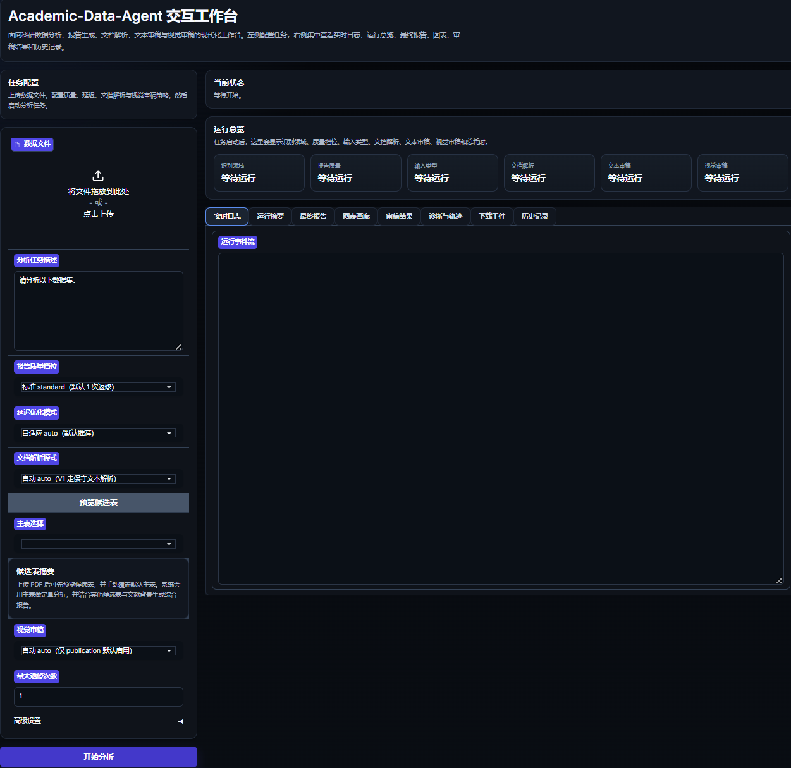
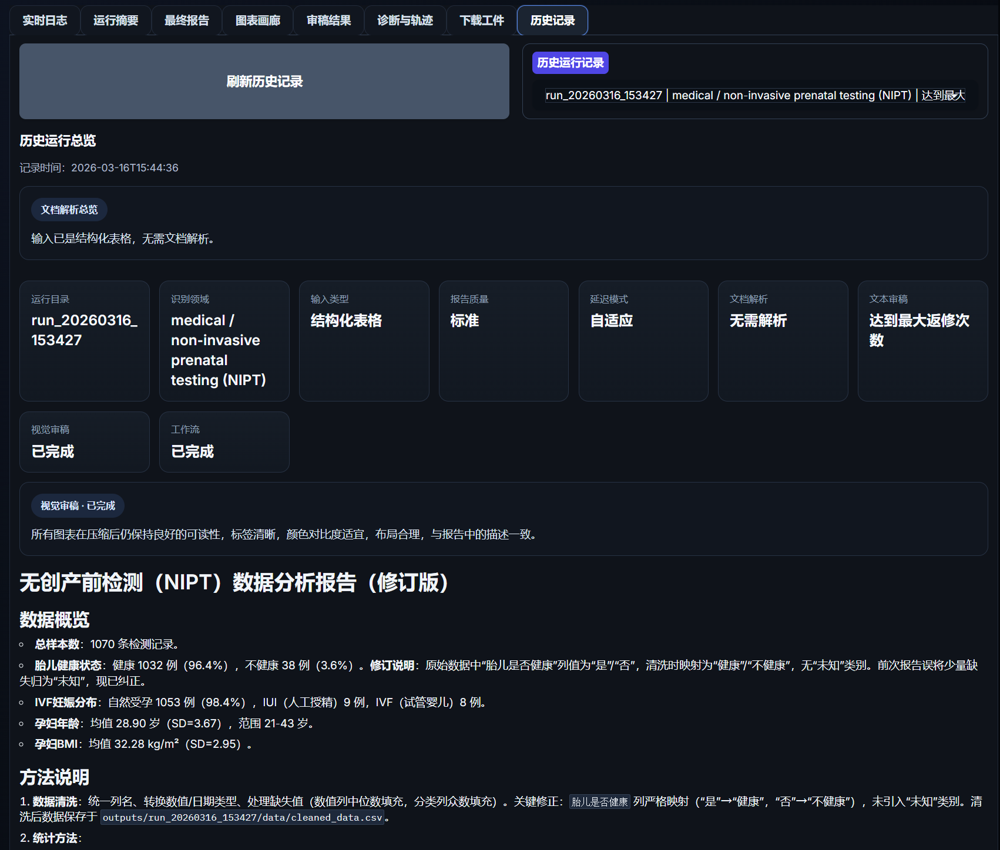
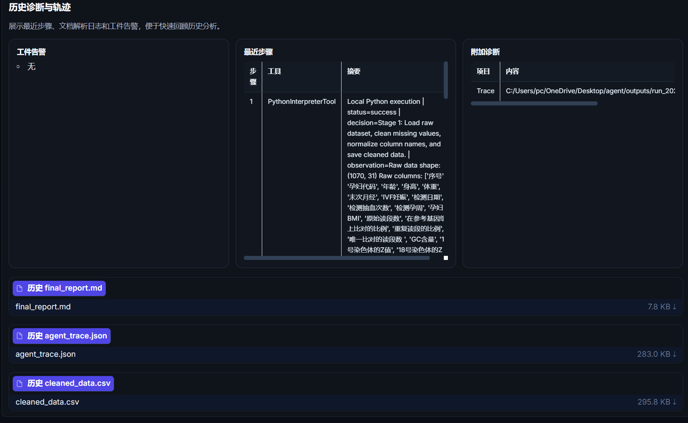

# Academic-Data-Agent

> 一个面向科研场景的智能数据分析 Agent，支持表格分析与 PDF 文献中的主表提取分析。

## 📝 项目简介

Academic-Data-Agent 是一个基于 Hello-Agents 思路构建的科研数据分析工作台。它把数据接入、分析执行、报告生成和审稿治理串成了一条完整工作流，既能处理 `csv / xls / xlsx` 结构化表格，也能处理文本型 PDF 文献。

对于 PDF 输入，项目并不是简单抽一张表就结束，而是采用“主表 + 文献背景 + 候选表摘要”的综合模式：

- 自动抽取论文正文摘要或前文背景
- 自动识别候选表，并选择一张主表做正式定量分析
- 其余候选表作为上下文证据参与报告解释

当前社区版是一个精简演示包，目标是便于在 Hello-Agents 社区中快速复现核心能力；完整版仓库保留了 Gradio 工作台、历史记录浏览和更完整的工程能力：

- 完整版仓库：[My-Academic-Data-Agent](https://github.com/healer-666/My-Academic-Data-Agent)

## ✨ 核心功能

- [x] 表格数据自动分析：支持 `csv / xls / xlsx`
- [x] PDF 文献解析：提取候选表、自动选择主表、注入文献背景
- [x] 结构化报告生成：输出 Markdown 报告、图表和 trace
- [x] 轻量审稿治理：支持 `draft / standard / publication`
- [x] PDF 小表强约束：避免模型对结果汇总表误用统计检验

## 🛠️ 技术栈

- Hello-Agents
- 自定义 Scientific ReAct 控制流
- PythonInterpreterTool / TavilySearchTool
- pandas / numpy / scipy / matplotlib / seaborn / statsmodels
- pdfplumber / pypdf
- Jupyter Notebook 演示

## 🚀 快速开始

### 环境要求

- Python 3.10+
- 建议使用虚拟环境

### 安装依赖

```bash
pip install -r requirements.txt
```

### 配置 API Key

```bash
cp .env.example .env
```

然后编辑 `.env`，至少填入以下项目：

```env
LLM_MODEL_ID=your_model_id
LLM_BASE_URL=https://your-openai-compatible-endpoint/v1
LLM_API_KEY=your_api_key
```

如果需要联网背景检索或视觉审稿，也可以继续补充：

```env
TAVILY_API_KEY=your_tavily_api_key
VISION_LLM_MODEL_ID=your_vision_model
VISION_LLM_BASE_URL=https://your-vision-endpoint/v1
VISION_LLM_API_KEY=your_vision_api_key
```

### 运行项目

```bash
jupyter lab
```

打开 `main.ipynb`，按顺序运行即可。

## 📖 使用示例

本项目在 Notebook 中内置了两段演示：

1. 一个 Excel 表格案例，展示标准表格分析流程
2. 一个 PDF 文献案例，展示候选表识别、主表选择和综合报告生成

演示默认使用轻量配置：

- `quality_mode="draft"`
- `latency_mode="auto"`

这样更适合社区评审快速复现。

## 🖼️ 界面展示

虽然本次提交以 Notebook 为主，但完整版项目还提供了 Gradio 工作台。下面保留三张界面截图供展示：


---


---


## 🎯 项目亮点

- 把科研数据分析从“单次脚本”升级为“可追踪工作流”
- 支持 PDF 文献中的主表分析，而不是只吃干净表格
- 对小样本结果表加入方法边界约束，减少统计跑偏
- 支持报告、图表、trace 的完整工件输出

## 📊 性能评估

当前完整版仓库已经具备较完整的自动化测试覆盖，核心链路包括：

- 文档解析
- 数据上下文构建
- 分析主流程
- 审稿与视觉审稿
- Web 工作台与历史记录

本社区版默认采用轻量演示参数，重点关注可复现性和工作流完整性，而不是追求极限性能。

## 🔮 未来计划

- [ ] 增强 PDF 多表路由能力
- [ ] 支持扫描版 PDF / OCR
- [ ] 提升视觉审稿的图表理解深度
- [ ] 提供更完整的社区版 Web Demo

## 🤝 贡献指南

欢迎提出 Issue 和 Pull Request。

如果你想体验完整工程版，建议直接访问完整版仓库。

## 📄 许可证

MIT License

## 👤 作者

- GitHub: [@healer-666](https://github.com/healer-666)

## 🙏 致谢

感谢 Datawhale 社区和 Hello-Agents 项目提供的学习与共创机会。
